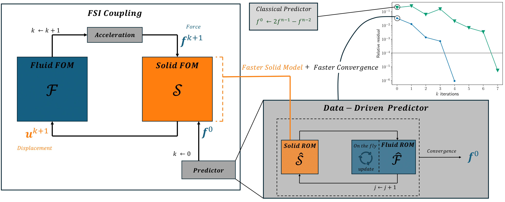

# Designing Machine Learning-Enhanced Predictors for Transient Fluid-Structure Interactions



[![CC BY-NC-ND 4.0][cc-by-nc-nd-shield]][cc-by-nc-nd]

This work is licensed under a
[Creative Commons Attribution-NonCommercial-NoDerivs 4.0 International License][cc-by-nc-nd].

[![CC BY-NC-ND 4.0][cc-by-nc-nd-image]][cc-by-nc-nd]

[cc-by-nc-nd]: http://creativecommons.org/licenses/by-nc-nd/4.0/
[cc-by-nc-nd-image]: https://licensebuttons.net/l/by-nc-nd/4.0/88x31.png
[cc-by-nc-nd-shield]: https://img.shields.io/badge/License-CC%20BY--NC--ND%204.0-lightgrey.svg

------------------------------------------------------------------------------------------------------------------------------------

This repository contains a presentation of the approach presented in [1] of ML-based predictors for Fluid-Structure Interaction (FSI) simulations.

The repository also contains files corresponding to the three example cases in the paper. This include configuration files for running the simulations, data files used in training the Reduced Order Models (ROM)s, and notebooks and files showing the API to train and use the models and reproduce the papers' results.

## Theory

See an introduction of the approach in [introduction.md](./fsi-rom-predictor/introduction.md).
We also refer to [1] and [2].

## Software

You can clone this repository using
```
git clone --depth 1 --branch main https://github.com/FsiROM/FSI-ROM-Predictor.git
```

The implementation of this approach is done using [KratosMultiphysics](https://github.com/KratosMultiphysics/Kratos) and the [ROM_AM](https://github.com/azzeddinetiba/ROM_AM) package. The Kratos applications used are:

&nbsp;&nbsp;&nbsp;&nbsp;* [StructuralMechanicsApplication](https://github.com/KratosMultiphysics/Kratos/tree/master/applications/StructuralMechanicsApplication) as the FEM solid solver.

&nbsp;&nbsp;&nbsp;&nbsp;* [FluidDynamicsApplication](https://github.com/KratosMultiphysics/Kratos/tree/master/applications/FluidDynamicsApplication) as the FEM fluid solver.

&nbsp;&nbsp;&nbsp;&nbsp;* [CoSimulationApplication](https://github.com/KratosMultiphysics/Kratos/tree/master/applications/CoSimulationApplication) as the black-box coupling library.

The ROM-FOM coupling approach and the new data-driven predictors are implemented in [a forked version](https://github.com/FsiROM/Kratos) from the v9.4.2 release. The implementation mainly concerns the ROM wrapper for the coupling, as well as the new predictor, both acting non-intrusively on the solvers.

The ROM methods used are implemented in the [ROM_AM](https://github.com/azzeddinetiba/ROM_AM) package. See [this demo](https://github.com/azzeddinetiba/ROM_AM/blob/main/examples/ReductionDemo.ipynb) for example.


The simulations have been tested with:

&nbsp;&nbsp;&nbsp;&nbsp;* MacOs 12.6 (arm64), Apple Clang 13.0.0 and Python 3.11 .

&nbsp;&nbsp;&nbsp;&nbsp;* Ubuntu 20.04 (X64), gcc 9.4.0 and Python 3.8 .


## Requirements
&nbsp;&nbsp;&nbsp;&nbsp;* Compiling the FsiROM version of Kratos from source (See [here](https://github.com/FsiROM/Kratos/blob/master/INSTALL.md)).

&nbsp;&nbsp;&nbsp;&nbsp;* Installing the ROM_AM package using pip (See [here](https://github.com/azzeddinetiba/ROM_AM/blob/main/README.md)).

## Reproducibility

To reproduce the results presented in [[1]](#References), the [`Comphy` tag of this repository](https://github.com/FsiROM/FSI-ROM-Predictor/tree/Comphy)  should be used, as well as installing the `Comphy` tags of [`ROM_AM`](https://github.com/azzeddinetiba/rom_am/tree/Comphy) and [`KratosMultiphysics`](https://github.com/FsiROM/Kratos/tree/Comphy). See the installation instructions at each repository.

```
git clone --depth 1 --branch Comphy https://github.com/FsiROM/Kratos.git
```
```
git clone --depth 1 --branch Comphy https://github.com/azzeddinetiba/ROM_AM.git
```
```
git clone --depth 1 --branch Comphy https://github.com/FsiROM/FSI-ROM-Predictor.git
```

**Data files** : The results already obtained by the author, and used in [[1]](#References) are available in the form of `.vtk` files and `numpy` arrays stored in `.npy` files. These files are not available with the current repository due to their large volume. The files can be found in this [`Zenodo` repository](https://zenodo.org/records/13909576). The Zenodo repository contains the data folders organized using the same structure of this repository. The user then can just replace the empty folders in this repository with the Zenodo folders. 

## References

[1] [Azzeddine Tiba, Thibault Dairay, Florian De Vuyst, Iraj Mortazavi, Juan-Pedro Berro Ramirez (2024). Machine-Learning Enhanced Predictors for Accelerated Convergence of Partitioned Fluid-Structure Interaction Simulations. arXiv preprint arXiv:2405.09941](https://doi.org/10.48550/arXiv.2405.09941)

[2] [Azzeddine Tiba, Thibault Dairay, Florian De Vuyst, Iraj Mortazavi, Juan-Pedro Berro Ramirez, Non-intrusive reduced order models for partitioned fluid–structure interactions, Journal of Fluids and Structures, Volume 128, 2024, 104156, ISSN 0889-9746.](https://doi.org/10.1016/j.jfluidstructs.2024.104156)
