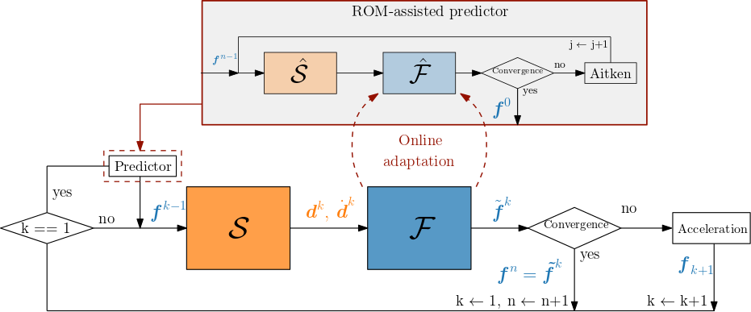

# ROM-assisted Predictors For Accelerated Convergence of Partitioned Fluid-Structure Interaction Simulations.
 ### Online adaptive ROMs with local dynamic subspaces



[![CC BY-NC-ND 4.0][cc-by-nc-nd-shield]][cc-by-nc-nd]

This work is licensed under a
[Creative Commons Attribution-NonCommercial-NoDerivs 4.0 International License][cc-by-nc-nd].

[![CC BY-NC-ND 4.0][cc-by-nc-nd-image]][cc-by-nc-nd]

[cc-by-nc-nd]: http://creativecommons.org/licenses/by-nc-nd/4.0/
[cc-by-nc-nd-image]: https://licensebuttons.net/l/by-nc-nd/4.0/88x31.png
[cc-by-nc-nd-shield]: https://img.shields.io/badge/License-CC%20BY--NC--ND%204.0-lightgrey.svg

This repository contains reproducible material for a new ROM-assisted predictor for partitioned FSI, using online adaptive ROMs, with local dynamic subspaces.


## Paper (2026)

- Preprint / DOI: incoming ..
- Authors: Azzeddine Tiba, Florian De Vuyst, Iraj Mortazavi

## Reproducibility (2026 paper)

The goal of this repository is reproducibility across multiple FSI settings.

### What is required

1. A Kratos build compatible with the ROM-assisted coupling workflow used in this project:
- The new ROM-assisted predictors are implemented in [a forked version of Kratos (v.0n.Adptv)](https://github.com/FsiROM/Kratos/tree/v.On.Adptv) from the v9.4.2 release.
2. The `rom_am` Python package version pinned in each example `requirements.txt`.
3. Example-specific Python environments (one per example is recommended).
4. Access to the files of the saved ROMs from Zenodo (see Data availability below).


### Data availability (Zenodo)

The used ROMs from the paper, for the two new examples, are saved in pickle files and are hosted externally.

- Zenodo record: [	
FSI-Online-ROM-Predictor-Data](https://zenodo.org/21860566)
- Zenodo DOI: [TODO: add DOI]
- The Zenodo repo has the same file tree as the current repo.

### Reproduce the two new examples

#### 1) `lid_driven`

Folder: `examples/lid_driven`

Install dependencies:

```bash
python -m venv .venv-lid
source .venv-lid/bin/activate
pip install -U pip
pip install -r examples/lid_driven/requirements.txt
```

Run workflow:

```bash
cp ini_common/* .
cp ini_testing_phase/* .
python MainKratos.py
```

Relevant outputs will be in the `CoSimData/` folder.


#### 2) `fsi_turek`

Folder: `examples/fsi_turek`

Install dependencies:

```bash
python -m venv .venv-turek
source .venv-turek/bin/activate
pip install -U pip
pip install -r examples/fsi_turek/requirements.txt
```

Run workflow:

```bash
cp ini_common/* .
cp ini_testing_phase/* .
python MainKratos.py
```

Relevant outputs will be in the `CoSimData/` folder.

## Legacy context (2024 paper and material)

The repository originally presented a similar approach, with the difference being the use of ROMs with global bases, and with the use of ROM-FOM coupling for additional acceleration:

- See [2, 3].
- The associated, older examples and notebooks remain available.
- The associated data repository is https://doi.org/10.5281/zenodo.13909576.

## Reproducibility

To reproduce the results presented in [[1]](#References), the [`Comphy` tag of this repository](https://github.com/FsiROM/FSI-ROM-Predictor/tree/Comphy)  should be used, as well as installing the `Comphy` tags of [`ROM_AM`](https://github.com/azzeddinetiba/rom_am/tree/Comphy) and [`KratosMultiphysics`](https://github.com/FsiROM/Kratos/tree/Comphy). See the installation instructions at each repository.

```
git clone --depth 1 --branch Comphy https://github.com/FsiROM/Kratos.git
```
```
git clone --depth 1 --branch Comphy https://github.com/azzeddinetiba/ROM_AM.git
```
```
git clone --depth 1 --branch Comphy https://github.com/FsiROM/FSI-ROM-Predictor.git
```

**Data files** : The results already obtained by the author, and used in [[1]](#References) are available in the form of `.vtk` files and `numpy` arrays stored in `.npy` files. These files are not available with the current repository due to their large volume. The files can be found in this [`Zenodo` repository](https://zenodo.org/records/13909576). The Zenodo repository contains the data folders organized using the same structure of this repository. The user then can just replace the empty folders in this repository with the Zenodo folders. 

## References

[1] [TODO: add new paper reference]

[2] [Azzeddine Tiba, Thibault Dairay, Florian De Vuyst, Iraj Mortazavi, Juan-Pedro Berro Ramirez (2024). Machine-Learning Enhanced Predictors for Accelerated Convergence of Partitioned Fluid-Structure Interaction Simulations. arXiv preprint arXiv:2405.09941](https://doi.org/10.48550/arXiv.2405.09941)

[3] [Azzeddine Tiba, Thibault Dairay, Florian De Vuyst, Iraj Mortazavi, Juan-Pedro Berro Ramirez, Non-intrusive reduced order models for partitioned fluid-structure interactions, Journal of Fluids and Structures, Volume 128, 2024, 104156, ISSN 0889-9746.](https://doi.org/10.1016/j.jfluidstructs.2024.104156)
