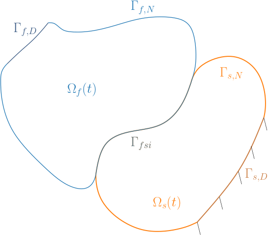
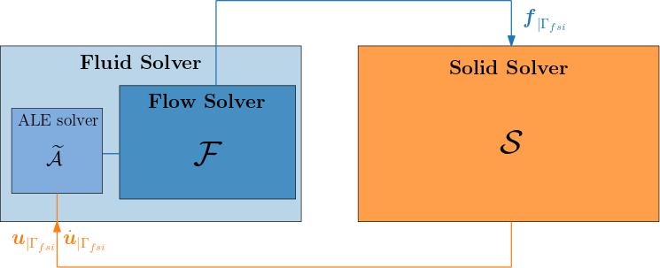
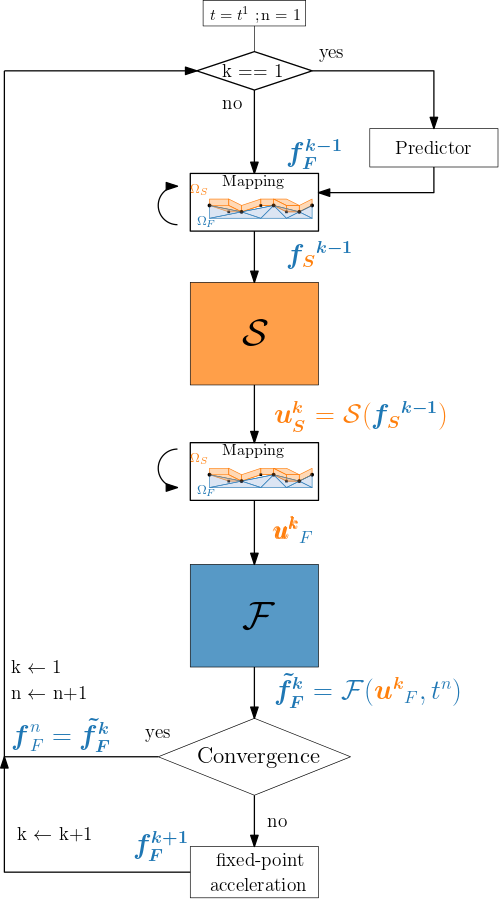
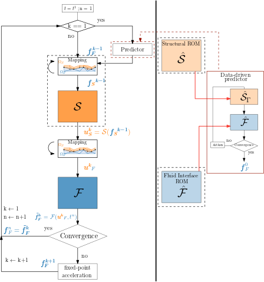
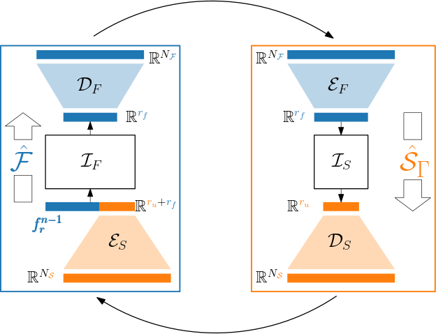
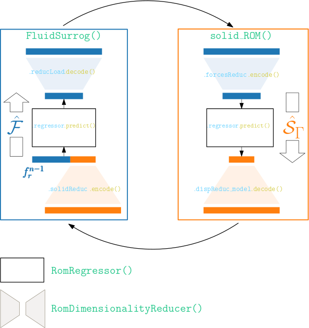

# Machine Learning-Enhanced Predictors for Transient Fluid-Structure Interactions

## The FSI coupling

In the context of partitioned FSI simulations, the $Dirichlet-Neumann$ coupling formulation allows a 'black-box' FSI coupling. In this framework, the fluid solver operation as $\mathcal{F}$ :

$$
  \mathcal{F} : \mathbb{R}^N \rightarrow \mathbb{R}^N\;;\; \boldsymbol{u}_{|\Gamma_{fsi}} \rightarrow \boldsymbol{f}_{|\Gamma_{fsi}}
$$

where $\boldsymbol{u}_{|\Gamma_{fsi}}$ is the displacement field and $\boldsymbol{f}_{|\Gamma_{fsi}}$ represents the fluid viscous and pressure forces at $\Gamma_{fsi}$:

$$
  \boldsymbol{f}_{|\Gamma_{fsi}} = (2 \mu_f  \boldsymbol{D}(\nabla\boldsymbol{v}) - p \boldsymbol{I} ) \cdot \boldsymbol{n}_{f|\Gamma_{fsi}}.
$$

Similarly, the solid operator is defined as:

$$
\mathcal{S} : \mathbb{R}^N \rightarrow \mathbb{R}^N\;;\; \boldsymbol{f}_{|\Gamma_{fsi}} \rightarrow \boldsymbol{u}_{|\Gamma_{fsi}}  .
$$

In strongly coupled schemes, the coupling conditions can be enforced  using a fixed-point formulation of the FSI problem:

$$
(\mathcal{F} \circ \mathcal{S})(\boldsymbol{f}_{|\Gamma_{fsi}}) = \boldsymbol{f}_{|\Gamma_{fsi}}.
$$

(Theoretically equivalent to $(\mathcal{S} \circ \mathcal{F})(\boldsymbol{u}_{|\Gamma_{fsi}}) = \boldsymbol{u}_{|\Gamma_{fsi}}$.)

One approach to solve this problem  at each time step is to compute Picard iterations plus a fixed-point acceleration using Quasi-Newton methods for the FSI problem:

$$
    (\mathcal{F} \circ \mathcal{S})(\boldsymbol{f}_{|\Gamma_{fsi}}) - \boldsymbol{f}_{|\Gamma_{fsi}} = \boldsymbol{0}
$$

**Remark**: The current work is restricted on FSI problems with neglected solid inertia.

An illustration of the parititoned coupling scheme used here is shown below:

## The initial guess predictor [2]

Another component of iterative FSI schemes is the predictor used to "kick-start" the next time step. Because of the time delay between the two solvers, there is no available "updated" solution for the solid solver to use in the first iteration. Usually, the last converged solution of the previous time step is used as a first guess
$
    \boldsymbol{f}^{0, n} = \boldsymbol{f}^{n-1}
$

A linear extrapolation from the previous time steps such as

$$
\boldsymbol{f}^{0, n} = 2\boldsymbol{f}^{n-1} - \boldsymbol{f}^{n-2}
$$

can also be used, or, alternatively, a quadratic variation:

$$
    \boldsymbol{f}^{0, n} = 3\boldsymbol{f}^{n-1} - 3\boldsymbol{f}^{n-2} + \boldsymbol{f}^{n-3}
$$

but whether this gives better convergence highly depends on each FSI problem and can result in bad performance if the time step is not sufficiently small. In this work, we propose an alternative approach to construct this predictor.

In this work, we propose to construct a data-driven predictor, based on the use of information from past data, for example past iterations/time steps, or historical simulation results obtained at different parameters values, thus providing a better initial guess than a finite-differences-based extrapolation.
A "reduced FSI coupling" is launched at the start of each time step, where each subsystem $\mathcal{F}$ and $\mathcal{S}$ is replaced by its reduced equivalent $\hat{\mathcal{F}}$ and $\hat{\mathcal{S}}$, and the solution

$$
    \hat{\mathcal{F}}(\hat{\mathcal{S}}(\pmb{f}^0)) = \pmb{f}^0
$$

is sought at a fraction of the computational time needed for the FOM-FOM problem solver calls. Those iterations will be called henceforth *local iterations*.

This new predictos can be illustrated along with the coupling scheme below:

## The ML-based ROMs
Following the approach first presented in [1], solid and fluid ROMs are combining well-established methods like PCA, POD, RBF interpolation, polynomial regression and Lasso regularization.

$$
\hat{\mathcal{S}}(\cdot) = \mathcal{D}_S\circ \mathcal{I}_S \circ\mathcal{E}_F(\cdot)
$$

where $\mathcal{E}$, $\mathcal{D}$ and $\mathcal{I}$ refer to the Encoders, Decoders and regressors respectively. $r_u$ and $r_f$ are the latent dimensions of the displacement and the forces respectively.

$$
\hat{\mathcal{F}}: \mathbb{R}^{2 N} \rightarrow \mathbb{R}^{N}\;;\; (\pmb{u}, \pmb{f}^{n-1}) \rightarrow {\pmb{f}} = \mathcal{D}_F(\mathcal{I}_F([\mathcal{E}_S(\pmb{u}), \mathcal{E}_F(\pmb{f}^{n-1})]^T)) .
$$

An illustration of these ROMs can be shown as

In fact, the black-box approach of the coupling can even allow the user to choose his favourite regression and Encoder-Decoder methods. This can be done to replace the solid solver (a notebook explaining the process can be found [here](https://github.com/FsiROM/SIMWorkshop/blob/main/FsiROM.ipynb).), and will be soon implemented for the predictor as well.

# Implementation

An illustration of the implementation of the above ROMs can be seen as the following

The used classes are

&nbsp;&nbsp;&nbsp;&nbsp;* [`solid_ROM`](https://github.com/azzeddinetiba/ROM_AM/blob/main/rom_am/solid_rom.py) that encompasses the solid ROM.

&nbsp;&nbsp;&nbsp;&nbsp;* [`FluidSurrog`](https://github.com/azzeddinetiba/ROM_AM/blob/main/rom_am/fluid_surrogate.py) that encompasses the fluid ROM.

&nbsp;&nbsp;&nbsp;&nbsp;* [`RomDimensionalityReducer`](https://github.com/azzeddinetiba/ROM_AM/blob/main/rom_am/dimreducers/rom_DimensionalityReducer.py) that holds the encoder and decoder methods.

&nbsp;&nbsp;&nbsp;&nbsp;* [`RomRegressor`](https://github.com/azzeddinetiba/ROM_AM/blob/main/rom_am/regressors/rom_regressor.py) that holds the regression function.

Every object of these classes has a <tt>train()</tt>.
 and a <tt>predict()</tt> method used in the offline and online steps respectively.

Once trained, these *ROMs* can be imported and called inside [the new predictor](https://github.com/FsiROM/Kratos/blob/feature-CoSim-RomFom/applications/CoSimulationApplication/python_scripts/predictors/surrogateBased.py).

The files associated to each example will be found in the corresponding folders. Each test case will involve different choices of the regression and dimensionality reduction methods. Notebooks detailing this can found inside those folders.

## References

[1] [Azzeddine Tiba, Thibault Dairay, Florian De Vuyst, Iraj Mortazavi, Juan-Pedro Berro Ramirez (2024). Machine-Learning Enhanced Predictors for Accelerated Convergence of Partitioned Fluid-Structure Interaction Simulations. arXiv preprint arXiv:2405.09941](https://doi.org/10.48550/arXiv.2405.09941)

[2] [Azzeddine Tiba, Thibault Dairay, Florian De Vuyst, Iraj Mortazavi, Juan-Pedro Berro Ramirez, Non-intrusive reduced order models for partitioned fluid–structure interactions, Journal of Fluids and Structures, Volume 128, 2024, 104156, ISSN 0889-9746.](https://doi.org/10.1016/j.jfluidstructs.2024.104156)
